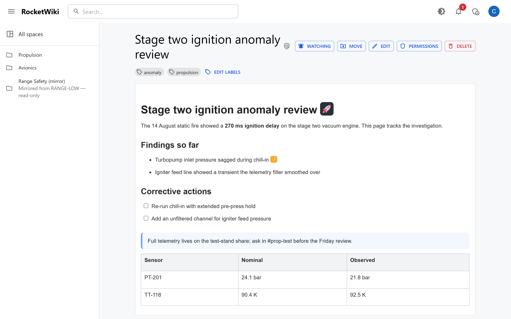
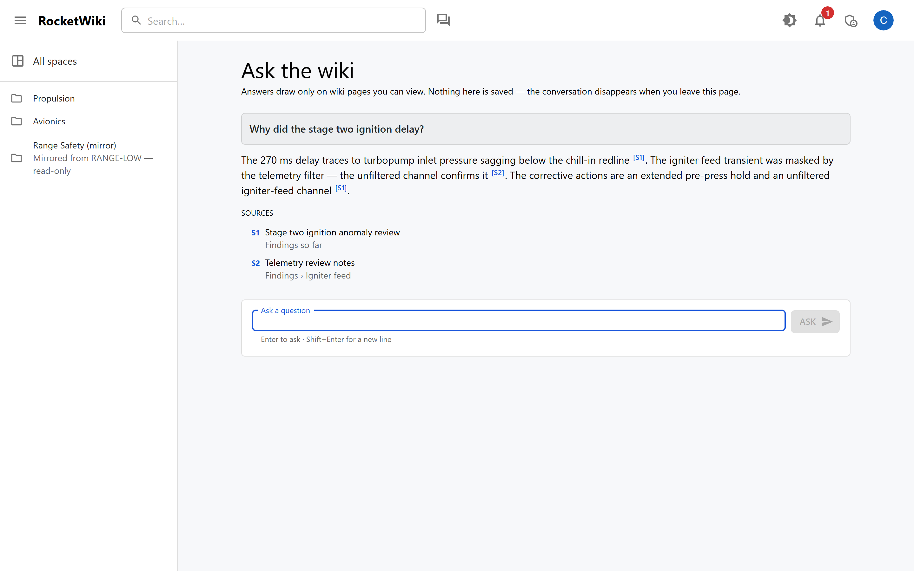
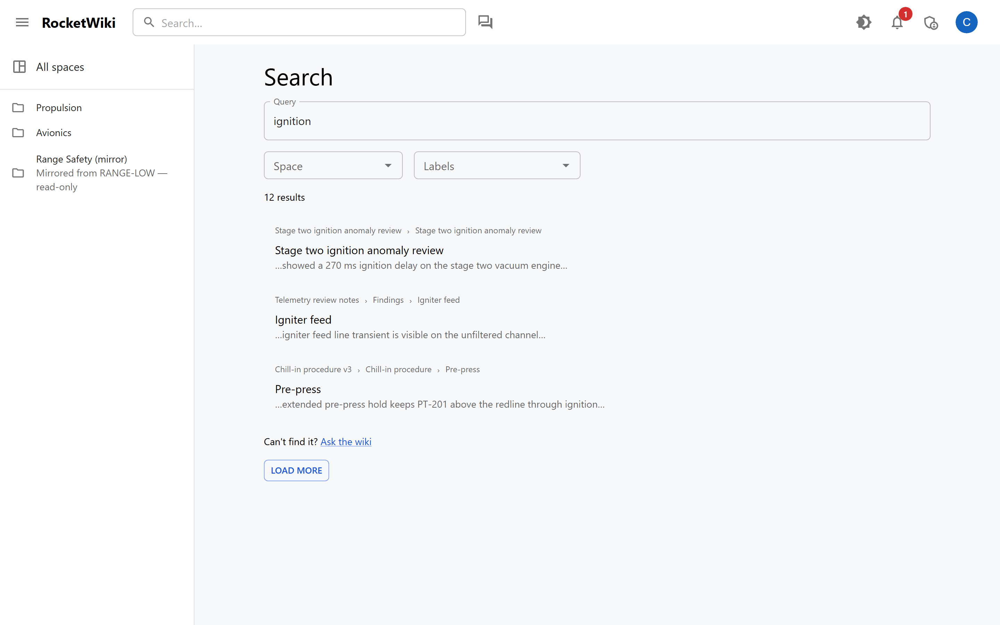
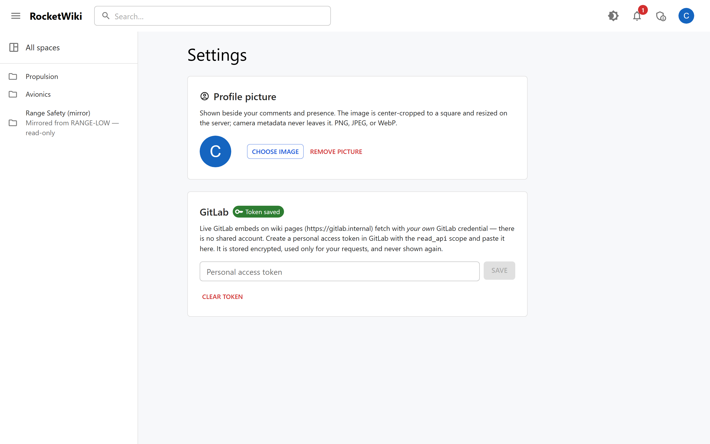

# RocketWiki

A self-hosted Confluence replacement for an aerospace company with
export-control requirements: WYSIWYG editing over a Markdown storage format, a
.NET/GraphQL backend, and attribute-based access control designed for
"engineering AND nationality NZ or US" style rules.



<details>
<summary>More screenshots: Ask the wiki, search with section-attributed results, and the Settings page</summary>







</details>

*Screenshots are real components with staged sample data, captured headlessly
— not a live deployment; see [docs/screenshots/README.md](docs/screenshots/README.md).*

**This is under active, parallel construction.** Every design.md §16
milestone except the Confluence migration trial is implemented and
test-verified (the SQL Server slice on every CI run), but nothing has been
deployed or run end to end on a real machine — see
[Current status](#current-status) before assuming anything works. To work
on it, start with [DEVELOPING.md](DEVELOPING.md).

A browsable version of all of these documents is published at
<https://veggielane.github.io/RocketWiki/>, regenerated from this repo on
every push to `main` — edit the canonical files here, never the site
(`docs-site/README.md` explains the scheme). Note: the repo is private but
the docs site is publicly readable by anyone with the URL.

The source of truth for *why* things are built this way is
[`design.md`](design.md) (architecture, access control, audit, deployment) and
[`data-model.md`](data-model.md) (the concrete EF Core / SQL Server schema).
This file is operational: how to get the code building and running, and what
has and hasn't actually been verified.

## Prerequisites

- **.NET 10 SDK** (developed against 10.0.400).
- **Node.js 24** and npm, for the `web/` frontend (developed against Node
  24.14.1 / npm 11.12.1).
- **A container runtime** (Docker or Podman) is required to run `aspire run` —
  it starts SQL Server, MinIO, and Keycloak as containers. **Not installed in
  the environment this was developed in**, so the full stack has never
  actually been started; see [Current status](#current-status).
- The Aspire CLI and project templates
  (`dotnet tool install -g Aspire.Cli`, `dotnet new install
  Aspire.ProjectTemplates`) if you want to scaffold further, though `aspire
  run`/`aspire publish` also work via the CLI tool once container tooling is
  present.

## Building and testing

```
dotnet build RocketWiki.sln
```

Builds every .NET project in the solution — Aspire AppHost, service defaults,
domain model, EF Core, the API, file storage, and their test projects.

```
dotnet test RocketWiki.sln
```

Runs every test project in the solution: `RocketWiki.Core.Tests` (rule engine,
domain events), `RocketWiki.Data.Tests` (EF model against SQLite),
`RocketWiki.Storage.Tests` (`FileSystemFileStorage` round-trip, overwrite, and
path-traversal safety; DI provider selection), `RocketWiki.Importer.Tests`
(owned by another agent), and `RocketWiki.Api.Tests` (the GraphQL schema-drift
check, the audit-declaration coverage check, and an integration tier that
exercises the real ASP.NET Core + Hot Chocolate pipeline — GraphQL mutations
*and* the plain-HTTP attachment routes — against EF Core on SQLite with a fake
authentication handler standing in for Keycloak — design.md §14's
container-free tier).

Every project also carries telemetry tests (design.md §15): `MetricCollector`
and `ActivityListener` coverage that the custom instruments emit with the tags
claimed, plus `TelemetryHygieneTests` in `RocketWiki.Api.Tests`, which sweeps
every ActivitySource in the process for page content, search text, and
principal attribute values. Those classes sit in a non-parallelizable xUnit
collection — an `ActivitySource` and a `Meter` are process-wide, so a listener
in one class otherwise captures whatever a class running in parallel emits.

To regenerate the checked-in GraphQL SDL after changing the schema:

```
cd src/RocketWiki.Api && dotnet run schema export --output ../../schema.graphql
```

`RocketWiki.Api.Tests` fails the build with a readable diff and this exact
command if `schema.graphql` drifts from the code (design.md §8).

### Frontend

```
cd web
npm install
npm run dev      # Vite dev server
npm run build    # tsc -b && vite build
npm test         # vitest
```

See [`web/README.md`](web/README.md) and `web/package.json` for the rest of
the frontend's own tooling (codegen, lint).

### Running the whole stack

```
cd src/RocketWiki.AppHost
aspire run
```

This is what *should* bring up SQL Server, MinIO, a Keycloak seeded with the
`rocketwiki` dev realm, and the API, with the Aspire dashboard for logs and
traces (design.md §15). **This has never been run** in the environment this
was built in — no container runtime was available. See below for exactly
what that means.

## Project layout

```
RocketWiki/
├── design.md, data-model.md      source of truth — read these first
├── RocketWiki.sln
├── src/
│   ├── RocketWiki.AppHost/        Aspire topology (SQL Server, MinIO, Keycloak,
│   │                              embeddings connection string, the API)
│   ├── RocketWiki.ServiceDefaults/ health checks, OpenTelemetry, resilience
│   ├── RocketWiki.Api/            ASP.NET Core + Hot Chocolate GraphQL, JWT
│   │                              bearer auth, audit-declaration attributes,
│   │                              EF Core + file storage DI wiring,
│   │                              request-scoped AuditContext + JIT user
│   │                              provisioning + IAuditSink (design.md §7/§11)
│   ├── RocketWiki.Storage/        IFileStorage: FileSystem + S3 providers
│   ├── RocketWiki.Core/           domain model, rule engine, domain events
│   ├── RocketWiki.Data/           EF Core, migrations, SQL Server specifics
│   └── RocketWiki.Importer/       Confluence space import pipeline (another
│                                  agent's project — not consumed by the API)
├── tests/
│   ├── RocketWiki.Api.Tests/      schema-drift + audit-coverage checks, plus
│   │                              a SQLite-backed integration tier (§14)
│   ├── RocketWiki.Storage.Tests/  filesystem provider + DI wiring
│   ├── RocketWiki.Core.Tests/     rule engine, domain events (unit)
│   ├── RocketWiki.Data.Tests/     EF model against SQLite (integration)
│   └── RocketWiki.Importer.Tests/ (another agent's project)
└── web/                           Vite + React + TypeScript SPA
```

All twelve .NET projects above are in `RocketWiki.sln`; `RocketWiki.Api`
references `RocketWiki.Core`, `RocketWiki.Data`, and `RocketWiki.Storage`.
The application service layer another agent built
(`RocketWiki.Core/Services/` — `IPageService`, `IPageReadService`,
`ICommentService`, `ILabelService`, `IAttachmentService`,
`IAttachmentReadService`) is now fully consumed: every GraphQL resolver and
mutation, and the two plain-HTTP attachment routes, route through it — never
a raw EF query or an entity's own navigation property, for exactly the
object-level-authorization reasons design.md §6.7/§8 calls for.

## Current status

Being explicit about what has and hasn't been checked, rather than letting
"it builds" stand in for "it works":

**Verified:**
- `dotnet build RocketWiki.sln` / `dotnet test RocketWiki.sln`, run solution-wide,
  reflect whatever every agent's projects look like *right now* — with several
  agents working in parallel, a transient break in one project (most recently,
  `RocketWiki.Importer`) is expected and not a signal the rest is broken. What's
  independently verified, per project this file's author owns: `RocketWiki.Api`
  and `RocketWiki.Api.Tests` build clean and 39/39 tests pass;
  `RocketWiki.Storage` and `RocketWiki.Storage.Tests` build clean and 26/26
  pass. Run each project's own `dotnet test <path>.csproj` rather than trust a
  number written here — it drifts, and a solution-wide run can fail for a
  reason that has nothing to do with the project you actually care about.
- **Request-scoped audit context and JIT user provisioning are real and
  tested**, not just declared: `ICurrentAuditContextAccessor` derives the
  audit channel from the actual request path (unit-tested per path), and
  `JitUserProvisioningMiddleware` upserts the local `User` row from token
  claims on every authenticated request (verified through real HTTP requests
  against the SQLite-backed integration tier, including that the same
  subject upserts rather than duplicates, and that anonymous requests
  provision nothing). `IAuditSink`/`DbAuditSink` (design.md §7's seam for
  reads and denials, which aren't domain events) is implemented and proven
  to fail closed — a request with no resolvable acting user, or no
  `AuditContext` available, throws and writes nothing rather than logging a
  misleadingly anonymous-looking row.
  **Load-bearing finding**: this originally used a middleware
  (`app.UseMiddleware<T>()`) to set state on `RocketWikiDbContext` for
  resolvers to read back, and it silently didn't work — Hot Chocolate
  executes resolvers in a different DI scope than that middleware pipeline,
  so a resolver's injected `RocketWikiDbContext` is a different *instance*
  than any middleware touched. Both `ICurrentAuditContextAccessor` and
  `IActingUserAccessor` now derive their values fresh from `HttpContext` on
  every read instead of relying on scoped-service instance identity to
  survive that boundary. Caught by the integration tier before it ever
  reached anything resembling production; would otherwise have made every
  real GraphQL read and mutation throw once real resolvers existed.
- **Page reads, writes, and object-level authorization are wired and
  adversarially tested** (design.md §6.7, §8): `page(id)`, `pageTree`, and
  `Page.parent`/`children`/`revisions` all route exclusively through
  `IPageReadService` — never a raw EF query or the entity's own navigation
  properties, which `PageType`/`PageRevisionType` explicitly suppress. Six
  mutations (create/update/move/delete/restore/restoreRevision) wrap
  `IPageService`, mapping its typed errors and auditing denials explicitly
  (mutation successes are audited by the domain-event pipeline instead).
  `PageAdversarialLeakTests` builds a tree with a restricted page and
  confirms it's absent — not merely inaccessible — through every path: direct
  query, as a child of a permitted parent, inherited by its own child, via
  revision history, and via tree traversal, while a sibling with no
  restriction and a principal who does satisfy the restriction both resolve
  correctly (so the negatives are a real restriction working, not the
  resolver being broken).
  **Gap closed this round**: denied *reads* are now audited with their
  reason. `IPageReadService` and `IAttachmentReadService` return the internal
  not-found-vs-denied result §6.7 specifies (`ReadResult<T>` /
  `AttachmentDownloadResult.Denied`), carrying the failing restriction the
  rule engine already computed (`restriction:{pageId}:{ruleId}`, or
  `no-space-role`); resolvers and the attachment route record it through
  `IAuditSink` (`ReadDenialAudit`) and then collapse it to the byte-identical
  null/empty/404 a genuine not-found gets — proven equal at the HTTP level,
  not just by parsed shape (`DeniedReadAuditTests`). A genuinely-missing page
  still audits nothing (no access decision was made; recording it as Denied
  would flood the probing signal with 404 noise), anonymous requests are
  unchanged, and tree *pruning* is deliberately not a denial — only a refused
  browse is. One sink-level rule made this safe: `DbAuditSink` suppresses a
  Success for a subject already recorded Denied in the same request, so a
  denied browse collapsed to an empty list never also claims success —
  confirmed to be load-bearing by disabling it and watching the test fail.
- **Comments, labels, and attachments are wired end to end** — GraphQL
  mutations (`addComment`/`editComment`/`deleteComment`,
  `createLabel`/`attachLabel`/`detachLabel`, `deleteAttachment`) and reads
  (`Page.comments`, `Page.labels`, `Page.attachments`), each `[AuditAction]`
  declared. None of these carry an authorization rule of their own — they
  inherit the parent `Page`'s canView/canEdit, already adversarially proven —
  so their tests (`CommentAndLabelMutationTests`) are functional
  (happy-path round trips, one genuine denial each) rather than a repeat of
  the adversarial leak suite.
- **The two non-GraphQL attachment routes** (`POST /attachments/{pageId}`,
  `GET /attachments/{id}`, design.md §8/§10) run through the same
  identity/authorization/audit pipeline as GraphQL — no side channel, no
  presigned URLs, ever. `AttachmentEndpointTests` proves: a full
  upload-then-download round trip; upload correctly refused (403, no row
  persisted) without `canEdit`; a fully anonymous upload rejected at the
  ASP.NET Core pipeline level (401) before any handler code runs; an
  attachment on a page the caller can't view returns 404 — identical to one
  that doesn't exist at all, the same "absent, not forbidden" rule as `Page`
  (design.md §6.7); and `AttachmentDownloadResult.BlobMissing` (the row
  exists but the stored object doesn't) surfaces as a structured, logged 500
  — `ProblemDetails` plus a server-side log line an operator can act on —
  never an unhandled exception.
- **`Page.children` is batched with a DataLoader** (`PageByIdDataLoader`) to
  fix the N+1 flagged in the previous round. Honest caveat: `IPageReadService`
  has no batch-fetch method, so this dedupes and parallelizes per request
  rather than reducing to one SQL query — a real improvement, not the full
  fix. A true single-query batch would need a new `IPageReadService` method,
  a Core-side change not requested here.
- The API runs standalone (`dotnet run` from `src/RocketWiki.Api`, outside
  Aspire) and its health endpoints (`/health`, `/alive`) and the `/graphql`
  endpoint (a placeholder `me` query reading claims off the request) actually
  respond correctly.
- **`RocketWikiDbContext` is wired into the API for real** (`AddSqlServerDbContext`,
  the official Aspire client integration, bound to the "rocketwiki" connection
  string) and genuinely exercised: `RocketWiki.Api.Tests`' integration tier
  runs the real GraphQL pipeline against EF Core on SQLite in memory, with a
  fake authentication handler standing in for Keycloak and
  `FileSystemFileStorage` pointed at a temp directory — no containers. This is
  the tier design.md §14 calls the bulk of the suite, and it's green.
- Migrate-on-startup is config-gated (`Database:MigrateOnStartup`, default
  `true`) and confirmed to do the right thing on **both** paths: a normal run
  attempts the migration and fails loudly against an unreachable SQL Server
  (proving it isn't silently skipped), while `dotnet run schema export` skips
  it entirely (proving the schema-export workflow doesn't require a database).
- `RocketWiki.Storage`'s filesystem provider is exercised by real disk I/O in
  its test suite, including seven distinct path-traversal attack strings, all
  correctly rejected.
- The GraphQL schema-drift test and the audit-declaration coverage test are
  each confirmed to actually fail when the condition they guard against is
  deliberately introduced, not just written and left untested against
  themselves.
- **OpenTelemetry now covers the whole backend, and design.md §15's "telemetry
  is not audit" rule is enforced by a test rather than by intent.** Beyond
  Aspire's stock ASP.NET Core/HttpClient/runtime baseline, the GraphQL
  pipeline, SignalR hub invocations and connections, EF Core's own metrics,
  and the .NET 10 authorization/authentication metrics are all subscribed;
  the rule engine, domain-event and audit pipelines, sync outbox and bundle
  export/import, both `IFileStorage` providers, JIT provisioning, presence
  and notification fan-out, and the importer's pipeline passes each declare
  their own `ActivitySource`/`Meter` (see design.md §15 for the full table
  and naming scheme). What's verified by tests: that the key instruments
  actually emit with the tags claimed (`MetricCollector`/`ActivityListener`
  unit tests across Core, Data, Storage and Importer); that a hub invocation
  and a GraphQL request really do emit on the exact third-party source names
  ServiceDefaults hard-codes; that counters increment only after a commit,
  proven by forcing a failed `SaveChanges` and asserting nothing was
  counted; and — the §15 one — that no sentinel nationality value, page
  title, page content, search-shaped literal, or attachment byte reaches any
  span name, tag, event, baggage entry, or metric tag across *every*
  ActivitySource in the process. That last test was confirmed to fail when
  the rule is deliberately broken, three separate ways: enabling
  `RequestDetails.All` (the query document lands on a span), restoring
  `MaxErrorEvents` (Hot Chocolate's `graphql.error.message` quotes the
  client's own query text straight back), and tagging a metric with a rule
  expression (the nationality values being matched). All three were caught
  with a readable failure naming the exact tag, then reverted — so the two
  §15-driven deviations from the library's defaults are demonstrably
  load-bearing, not cargo-culted.
  Load-bearing finding along the way: `Aspire.Microsoft.EntityFrameworkCore.SqlServer`
  13.5.1's `AddSqlServerDbContext` registers **only** `AddSqlClientInstrumentation()`
  plus a DbContext health check — no EF Core instrumentation and **no metrics
  at all** (confirmed by decompiling the package, same practice as the
  Keycloak realm work). So SQL query tracing was already covered and must not
  be registered a second time, while EF Core's meter was a genuine gap.
  Second finding, about the tests rather than the code: an `ActivitySource`
  and a `Meter` are process-wide, so a listener in one test class captures
  what a class running in parallel emits. The telemetry test classes are in a
  non-parallelizable xUnit collection for that reason; without it the
  assertions would have had to be weakened to "contains something of roughly
  this shape", which would pass even if the instrumentation emitted nothing.
- **Browser telemetry is wired and unit-tested** (a frontend agent's work,
  reported rather than independently reverified here): `web/src/telemetry`
  adds OpenTelemetry to the SPA behind a configuration gate — with no
  `VITE_OTEL_EXPORTER_OTLP_ENDPOINT` set, the tracing SDK is never even
  downloaded; Vite splits it into its own 75 kB chunk that an unconfigured
  build never requests. 73 tests cover the gate (off when unset, and off for
  a malformed endpoint), the query/fragment redaction that keeps search text
  and heading-anchor slugs out of spans (design.md §15), the `traceparent`
  allowlist checked against the SDK's own matcher rather than our
  assumptions about it, and the GraphQL operation-name enrichment —
  including an assertion that no variable value, document text, or response
  body reaches a span.
- **The MCP server is real and adversarially tested** (design.md §8,
  milestone 8): `/mcp` runs in the API process over the official C# SDK
  (stateless streamable HTTP), so every tool call is an individually
  authenticated request through the same JIT-provisioning and audit pipeline
  as GraphQL. The four read-only v1 tools call the identical services the
  resolvers call — never raw EF — and a restricted page or space is
  *byte-identical* on the wire to a nonexistent one (proven by
  serialized-result equality), while the restricted case — and only it —
  writes a Denied `mcp`-channel audit row with its failing restriction
  through the same `ReadDenialAudit` path GraphQL uses. Anonymous calls die
  at the pipeline with the MCP spec's resource-metadata discovery challenge;
  every successful call writes an `mcp`-channel audit row carrying the
  client's self-reported name; the audit-declaration guard now covers tools
  (build-time sweep plus a runtime refusal for undeclared tools, both proven
  to fire). Unverified, same as everything Keycloak: no real OAuth flow has
  run — discovery shape and token-validation wiring are tested, a live
  client obtaining a Keycloak token is not; and RFC 8707 resource-audience
  alignment is an open realm-config question.
- **The k3s deployment package (milestone 9) is authored but entirely
  unexercised.** `Dockerfile.api`, `Dockerfile.web`, and the Helm chart in
  `deploy/helm/rocketwiki/` exist, `helm lint` passes and `helm template`
  renders valid YAML (including the guard rails: api.replicaCount is
  hard-locked to 1, telemetry export fails closed, secrets are referenced
  never templated) — and that is the *whole* claim. No image has ever been
  built, no manifest applied, and the EF migrations bundle the migration Job
  depends on has never been generated or run; like everything else behind
  the container-runtime gap, assume it doesn't work until it's been watched
  working. Known src-side follow-up it surfaced: ServiceDefaults maps
  `/health`/`/alive` only in Development, so the chart probes TCP until
  those endpoints get a config gate for production. `deploy/README.md` has
  the build/offline-install/restore-drill procedures and its own, longer
  "what has never been verified" list.
- `RocketWiki.Core.Tests` and `RocketWiki.Data.Tests` (owned by another
  agent) have passed as part of a solution-wide run in the past — not
  independently reverified by this file's author this round (see the
  solution-wide build/test caveat above); the EF model runs against SQLite in
  that suite too, independently of the API-level integration tier above.

**Explicitly unverified — no container runtime was available:**
- **The entire Aspire container topology.** SQL Server, MinIO, and Keycloak
  have never actually been started by `aspire run`. Resource wiring
  (`WithReference`, service discovery, connection string injection) is
  correct by inspection and compiles, but has not been observed working at
  runtime. (The migrations themselves and `MigrateOnStartup`'s happy path
  are no longer in this list — CI's `sqlserver` job now proves them against
  a real engine; see the CI-verified bullet above. What remains unverified
  here is the Aspire wiring itself.)
- **The Keycloak dev realm import**
  (`src/RocketWiki.AppHost/keycloak/rocketwiki-realm.json`). The JSON is
  syntactically valid and was checked by decompiling the Aspire Keycloak
  hosting package to confirm exactly how `--import-realm` and the bind mount
  work, but no realm has actually been imported, no user has logged in, and
  no token has been decoded to confirm the `groups`/`nationality`/`aud`
  claims land as designed. Targets Keycloak `26.6.1` (the hosting package's
  default image tag) — see that folder's own `README.md` for the full detail
  and what production Keycloak needs to reproduce instead.
- **`RocketWiki.Storage`'s S3 provider** against a real S3-compatible
  endpoint. Only its DI/config wiring is tested; `PutObjectAsync`,
  `GetObjectAsync`, etc. have never run against MinIO or anything else.
- **That any of the OpenTelemetry above has ever left the process.** No OTLP
  endpoint and no Aspire dashboard has ever received a single span or metric
  from RocketWiki — the exporter only activates when
  `OTEL_EXPORTER_OTLP_ENDPOINT` is set, which requires `aspire run`, which
  requires the container runtime this environment doesn't have. The tests
  prove the instruments emit and that §15 holds at the `ActivitySource` /
  `Meter` boundary; they say nothing about serialization, the OTLP exporter,
  sampling under load, or what a dashboard actually renders. Two specific
  things to check on the first real run: that ServiceDefaults' `RocketWiki.*`
  wildcard actually picks the custom sources up (`AddSource`/`AddMeter`
  wildcard subscription is documented by OpenTelemetry .NET, and a guard test
  asserts every source and meter is named to match the pattern, but the two
  halves have never been exercised together against a live SDK), and that
  span volume is sane — GraphQL scopes are set to everything except per-field
  resolvers, which is a judgement call made without ever having seen the
  trace count.
- **That any browser span has ever been exported to a real OTLP endpoint.**
  The exporter's transport is mocked in the web tests; the only evidence the
  export leg does anything at all is an early draft that let it run for real
  and produced `ECONNREFUSED` against a dashboard that wasn't running. The
  Aspire AppHost still doesn't run the Vite dev server (a commented-out TODO
  in `AppHost.cs`), so nothing injects the endpoint automatically yet —
  `web/.env.example` documents the variables for standalone `vite dev`,
  including the easily-missed detail that the dashboard's OTLP/HTTP port is
  18890, not the gRPC 18889.
- **The SPA is fully wired to the reconciled schema**: server-computed
  permissions shape every affordance (edit/move/delete/comment/permissions),
  page restrictions and the effectivePermission inspector are live, replica
  spaces are marked proactively, and watches/labels/archived-spaces/audit
  totals read server truth. No `NOTE (schema reconciliation)` markers
  remain in `web/src`.
- **Permissions shape the UI** (design.md §6.6): `Page` exposes
  `canEdit`/`canComment`/`canManageAccess` for the current caller (batched,
  replica-aware), a manage-gated `restrictions` listing, tree lock markers,
  and an `effectivePermission` inspector with per-rule pass/fail — all
  fail-closed, all audited (`permission.inspect`). The SPA's already-built
  permission components wire up in the un-stub round.
- **CI-verified against real SQL Server (never yet on a developer
  machine):** the checked-in migrations apply from zero to a real,
  FTS-enabled SQL Server 2025 container — including the FULLTEXT
  catalog/index DDL, filtered indexes, CHECK constraints, and the
  AuditEvents IDENTITY — and `Database:MigrateOnStartup`'s happy path boots
  the real API host, migrates, and answers `/graphql`. Keyword search's
  CONTAINSTABLE branch is exercised for real (stemming-only matches, FTS
  ranking, permission filtering on that branch), as are outbox sequence
  gap-freedom, audit-transaction rollback, and declared-length enforcement.
  Building this tier surfaced two real bugs before any engine ever ran the
  code: the FULLTEXT DDL could never have applied inside EF's migration
  transaction (now `suppressTransaction: true`), and raw user queries were
  CONTAINS-grammar syntax errors (now a quoted `FORMSOF(INFLECTIONAL, …)`
  builder, unit-tested). All of this runs only in CI's `sqlserver` job
  (`tests/RocketWiki.SqlServer.Tests`); on machines without Docker the tier
  skips visibly and these claims are only as fresh as the last green CI
  run.
- **Collaborative editor (SPA, design.md §8)** — the TipTap editor now
  co-edits over the existing hub connection: a hand-rolled SignalR Yjs
  provider (no y-websocket) joins the relay session, seeds or replays per
  the server's role assignment, batches keystrokes into merged updates and
  throttles carets on the real awareness protocol, and handles log-cap
  save-and-reseed, seeder loss, eviction to read-only, and reconnect
  (rejoin-and-replay; the one divergent-lineage corner that can duplicate
  text is documented in the provider, not hidden). A refused or unreachable
  join falls back to the unchanged solo editor — co-editing is progressive
  enhancement. Session saves submit against the session base revision and
  toast the server-resolved contributors; presence pointers ride along on
  the edit route. Building it surfaced a real round-trip bug (StarterKit
  v3's trailing-node chrome serialized as a phantom blank paragraph — fixed
  at the serializer, corpus still byte-identical). Two real editors syncing
  over a scripted relay are under test; per the standing caveat, no browser
  has yet driven the live hub.
- **Ask the wiki (backend, design.md §9.5)** — `askWiki(question)` answers
  from wiki content with per-section citations, retrieving only pages *you*
  can view (the same permission-filtered search and canView-gated reads as
  everything else) before any text reaches the model — proven by a test
  that records every message sent to a fake model and asserts a restricted
  page's sentinel never appears for a non-cleared asker. Honest scope: your
  question and the retrieved viewable content are sent to the
  operator-configured, in-network LLM endpoint; unconfigured instances
  answer `NOT_CONFIGURED`, and every ask is audited (`assistant.ask`) with
  the question and the pages involved. The chat UI lives at `/ask` (an app-bar
  entry beside search, plus a "Can't find it?" hand-off from search results):
  a session-local transcript, `[Sn]` markers rendered as superscript
  deep-links into the cited page sections, the model's output rendered
  strictly as text, and every affordance collapsing for the session on an
  unconfigured instance — the attempt is the probe, since no status field
  exists.
- **Native vector search (design.md §9.3)** — `PageEmbedding` now uses SQL
  Server 2025's `vector(1536)` column with in-engine `VECTOR_DISTANCE`
  scoring (CI-verified by the Testcontainers tier, including §6.7 on that
  path). The DiskANN index is deliberately deferred with engine-verified
  reasons (`VECTOR_DISTANCE` is index-blind by documentation; boxed 2025's
  index format is preview-gated and makes the table read-only) — both
  limitations are tripwire-tested so their lifting is detected, not hoped
  for.
- **Real-time co-editing (backend, design.md §8)** — Yjs relay sessions
  over the SignalR hub: canEdit-gated and session-audited (join denials
  recorded with their failing restriction), seeder/reseed protocol with log
  caps, rule-change eviction closing the relay, and multi-author revision
  attribution (`PageRevisionContributor`, resolved only from server-side
  session state — client-supplied contributor lists don't exist in the
  API). The collaborative editor UI (TipTap + Yjs, live carets) is the
  in-flight phase 2; the SignalR transport's default 32 KB receive limit
  was raised to fit real Yjs seeds — found by test, not in production.
- **Profile pictures + Gravatar endpoint (backend, design.md §19)** —
  user-uploaded avatars (PNG/JPEG/WebP in, server-normalized canonical
  512×512 PNG stored — originals and their EXIF never persisted), self-only
  set/clear, audited; `UserRef.hasAvatar`/`me.hasAvatar` for rendering.
  Optionally the wiki serves the Gravatar/Libravatar protocol at
  `GET /avatar/{hash}` for other in-network tools — **honest caveat: this
  endpoint is unauthenticated by design** (that's the protocol), so it is
  off by default (`Avatars:GravatarEndpointEnabled`) and enabling it means
  anyone on the network can fetch avatars and probe which email hashes have
  one; the network boundary is the only wall. Example consumer: point
  GitLab at the wiki with `gravatar_enabled: true` and
  `gravatar_url: "https://wiki.example.com/avatar/%{hash}?s=%{size}&d=404"`.
- **Custom emojis (backend, design.md §19)** — instance admins manage a
  `:name:` registry (`POST/DELETE /emojis/{name}`, audited); any
  authenticated user gets `GET /emojis/{name}` (ETag/304) and the
  `customEmojis` GraphQL list. Uploads are normalized via
  SixLabors.ImageSharp 3.1.12 (**Split License** — Apache-2.0 for
  open-source/small-org use, commercial otherwise; 4.x additionally needs a
  build-time license key, so upgrading is a version bump plus that key):
  decode-limited, squared to 32–256 px, re-encoded with metadata stripped;
  animated GIF supported (64-frame cap).
- **Profile pictures & custom emojis (SPA)** — upload an avatar in Settings
  (server-normalized to a square 512 PNG, metadata stripped); faces appear
  beside comments, presence, and bylines, with initials as the fallback.
  Instance admins curate a `:name:` emoji registry under Admin → Custom
  emojis; type `:` in the editor to autocomplete, and unknown names simply
  stay text — including in content synced from another instance. Emoji
  rendering is a read-mode decoration over literal text, so the Markdown
  round-trip is untouched by construction (corpus vectors prove it).
- **GitLab integration (backend, design.md §18)**: `gitlabIssue`/
  `gitlabIssues`/`gitlabFile` queries proxying GitLab REST v4 under the
  *calling user's own* encrypted PAT (no service account, ever — the
  read-around §6 forbids; adversarial cross-user credential isolation is
  pinned by test), fail-closed on `GitLab:BaseUrl`, live-never-cached with
  typed degradation, audited as `gitlab.fetch`, token write-only by
  construction. Along the way it surfaced and fixed a real audit bug:
  `DbAuditSink`'s per-request dedup never actually spanned resolver scopes
  (Hot Chocolate resolvers don't share the middleware's DI scope — the same
  boundary Program.cs documents); it now dedups via `HttpContext.Items`,
  proven by an alias test. Unverified: no live GitLab has ever answered
  these clients — REST shapes come from docs + a faked wire.
- **GitLab integration (SPA)** — link issues with live open/closed status,
  embed repository files, and list issues by filter, all fetched through
  the wiki API with *your own* GitLab token (set it under Settings;
  `read_api` scope is enough). References are host-free and stay plain
  Markdown, so pages sync and export unchanged even where GitLab is
  unreachable. Every GitLab affordance (toolbar menu, chips, settings
  section) vanishes entirely when `GitLab:BaseUrl` is unconfigured.
- **Tables** support GFM column alignment, merged cells (colspan/rowspan
  via MultiMarkdown syntax), and `<br>` line breaks inside cells — all
  round-tripping byte-identically through the editor. The Confluence
  importer preserves them too — merged cells, alignment, and cell line
  breaks convert at full fidelity (only header-boundary-crossing rowspans
  still degrade, split with a conversion-report note; captions, previously
  dropped silently, now flatten with a note — a fixed bug).
- **Edit conflicts show a Markdown diff** of the other author's revision
  against your draft right in the conflict dialog, so you can keep yours,
  take theirs (your text goes to the clipboard), or keep editing.
- **Diagrams**: ` ```mermaid ` blocks render inline (live preview while
  editing), and draw.io diagrams embed as base64 editable SVG with in-place
  editing via a configured diagrams.net instance (`VITE_DRAWIO_URL`,
  fail-closed). Both are plain fenced Markdown — round-trip, sync, and
  import untouched. The diagrams.net postMessage handshake has never run
  against a live instance (standing container caveat).
- **The frontend** now generates its typed client from the exported
  `schema.graphql` and defaults to the real SignalR transports against
  `/hubs/notifications` (fakes only behind `VITE_FAKE_REALTIME`) — but no
  browser has ever connected to the hub or executed a query against a live
  API; everything is verified by vitest against a mocked exchange and a
  mocked hub connection builder. The generated client is deliberately
  untracked; CI runs `npm run codegen` from the committed `schema.graphql`
  before building.
- Real login, real page CRUD, real search, real anything involving SQL
  Server or Keycloak issuing a token — none of it exists yet at more than a
  placeholder level (see design.md §16's milestone list for what's next).
